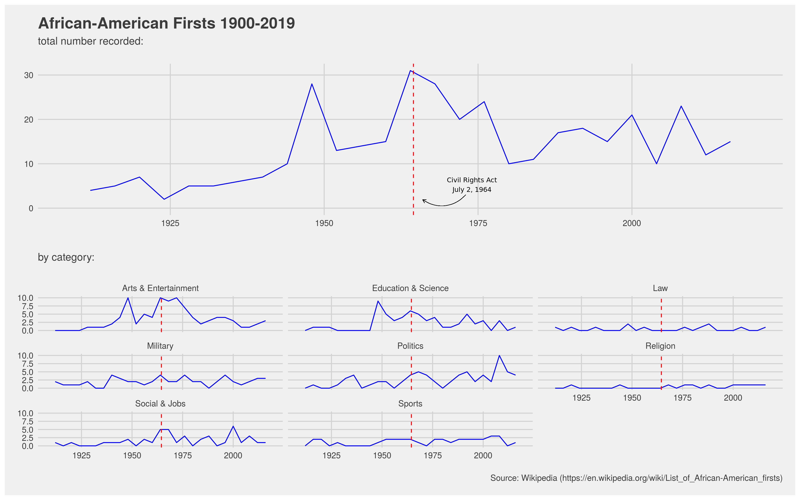
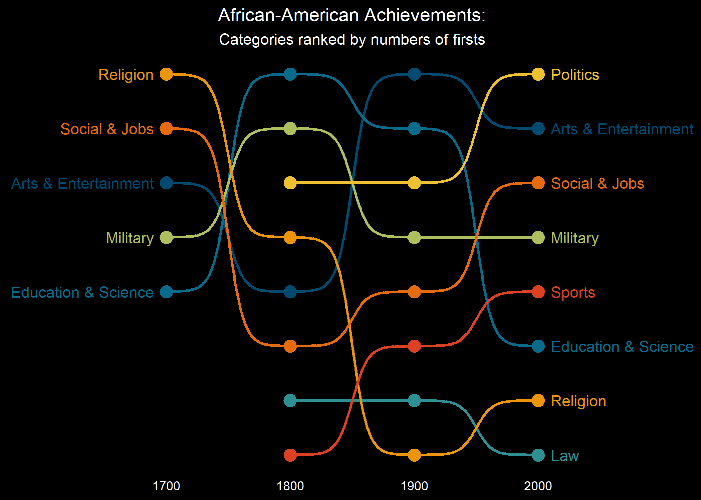

```{r setup, include=FALSE}
knitr::opts_chunk$set(echo = FALSE)
library(tidyverse)
library(plotly)
library(skimr)
```

## More Info About this Dataset

https://github.com/rfordatascience/tidytuesday/tree/master/data/2020/2020-06-09

## The Tables

There are two different tables that we'll be looking at in the `data` folder. 

```{r}
firsts <- read_csv("data/firsts.csv") %>%
  mutate(row_num = row_number()) %>%
  select(row_num, year, category, gender, person, accomplishment)
science <- read_csv("data/science.csv")
```

# Nicola Long

```{r}


```

# Pierrette Lo

```{r}


```

# Ted Laderas

```{r fig.width=8, fig.height=8}
library(plotly)
library(wesanderson)

new_firsts_wrapped <- firsts %>%
  mutate(row_num = fct_reorder(as.factor(row_num), year)) %>%
  mutate(accomplishment = str_wrap(accomplishment, width = 40)) %>%
  mutate(category = fct_rev(category)) %>%
  filter(category %in% c("Arts & Entertainment", "Education & Science", "Politics", "Social & Jobs", "Sports"))

new_plot <- ggplot(new_firsts_wrapped) + 
    aes(x=year, y=category, person = person, 
        label=accomplishment, color=category) +
  geom_jitter() +
  theme(legend.position = "none", axis.title.y = element_blank()) +
  labs(title = "African American Firsts") +
   scale_color_manual(values = wes_palette("Darjeeling1", n = 5))

label_format <- list(align="left")

ggplotly(new_plot,tooltip = c( "person", "year", "accomplishment", "category")) %>%
  style(hoverlabel = label_format) 
```

```{r fig.width=8, fig.height=8}
library(plotly)

science_subset <- science %>%
  filter(grepl('nvent', occupation_s, fixed=FALSE)) %>%
  mutate(name = fct_reorder(name, birth)) %>%
  mutate(death = tidyr::replace_na(death, 2020)) %>%
  mutate(inventions_accomplishments = str_wrap(inventions_accomplishments, width = 50)) 
  
sci_plot <- ggplot(science_subset) + 
  aes(x=birth, xend=death, y=name, yend = name,
      name = name, label=inventions_accomplishments, color=occupation_s) +
  geom_point() +
  geom_point(aes(x=death)) +
  geom_segment() +
  theme(legend.position = "none") +
  labs(title = "African American Inventors")
  
lab <- list(align="left")

ggplotly(sci_plot,tooltip = c("name", "occupation_s", "inventions_accomplishments")) %>%
  style(hoverlabel = lab)
```

